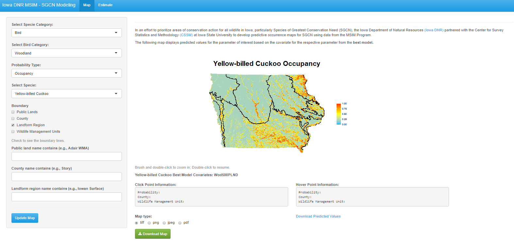

## Introduction

This repository contains R Shiny code used to develop an interactive map of Iowa and to show predicted occupancy/colonization/detection probabilities for around 70 wild species including birds, mammals, reptiles, amphibians, odonates and butterflies. Most of them are birds.

## Demo

Below is a screenshot of the tool. On the left is an user-input panel (such as specie category, area boundary, etc.). On the right is a static heatmap of Iowa made with `ggplot2`. Blue indicates low probability and red indicates high. Data at the clicked or hovered map location are shown in the text boxes below the map. User can even use mouse brush to zoom in and double click the map to zoom out. Those functionalities now look old-fashioned but I was quite proud of this achievement in the early days. :laughing:

## Technical details

Due to data privacy issue, we cannot share the data (used to build this Shiny tool) with the public. This tool was developed back in 2016 when some popular and useful R packages such as `plotly`, `leaflet` or `shinydashboard` were not available yet. So I have to realize user-map interaction (hover, click and zoom) brute-forcefully. Most of those interactivities were made possible by accessing the value of `plot_click`, `plot_hover` or `plot_brush`. One can find more information in the file **server.r**.

## Reference

Harms, T.M., Murphy, K.T., **Lyu, X.**, Patterson, S.S., Kinkead, K.E., Dinsmore, S.J. and Frese, P.W., 2017. Using landscape habitat associations to prioritize areas of conservation action for terrestrial birds. PloS one, 12(3).
